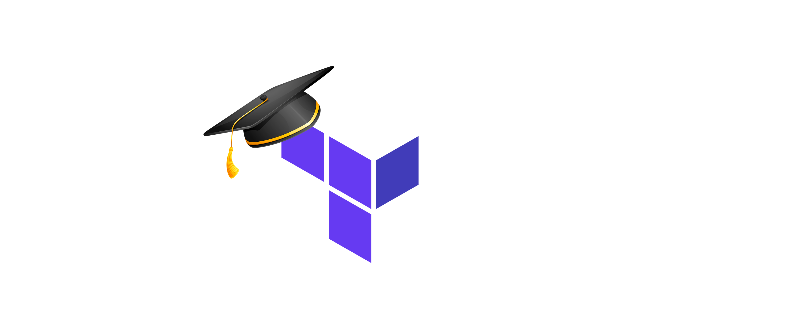

# [Associate] SEPHORA Terraform Course - Lab 01



After following the tutorial steps, you'll aquire the following knowledges:
- Run basic terraform commands
- know how to read and inspect Terraform code

Firstly, we'll authorize gcloud to access the Cloud Platform with Google user credentials

```bash
gcloud auth login
```

Answer Yes when prompted, click the link that should appear after that, chose your account then click allow.

Let's inspect what we have,
```bash
cd iac
cat main.tf
```

This is the code to deploy a Google Storage Bucket.

Replace **"your-project-id"** with an existing project id (Should be provided by socle GCP Team).
Bucket name should be unique accross the globe, so add a random suffix to the bucket name, example : "auto-expiring-bucket**-8653"**

Run :
```bash
Terraform init
```
this command will initialise terraform, i.e download locally Google Cloud SDK to be able to run api calls next.

Let's see what resources are going to be created by the code, to do this run:
```bash
Terraform Plan
```

It's time now to create the resources describe by our IaC. to do this run :
```bash
Terraform apply --auto-approve
```

Verify that the bucket is created successefully via the Google Cloud Console.

Notice that Terraform generates a **tfstate** file locally that contains traces of what has been created. inspect it.
```bash
cat terraform.tfstate
```
